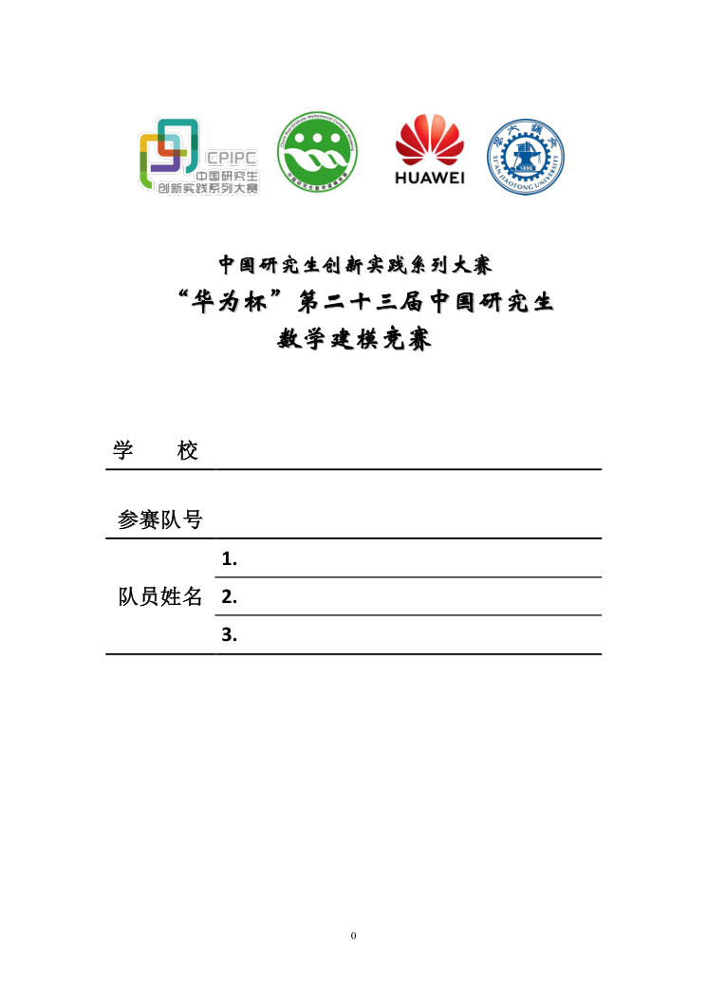
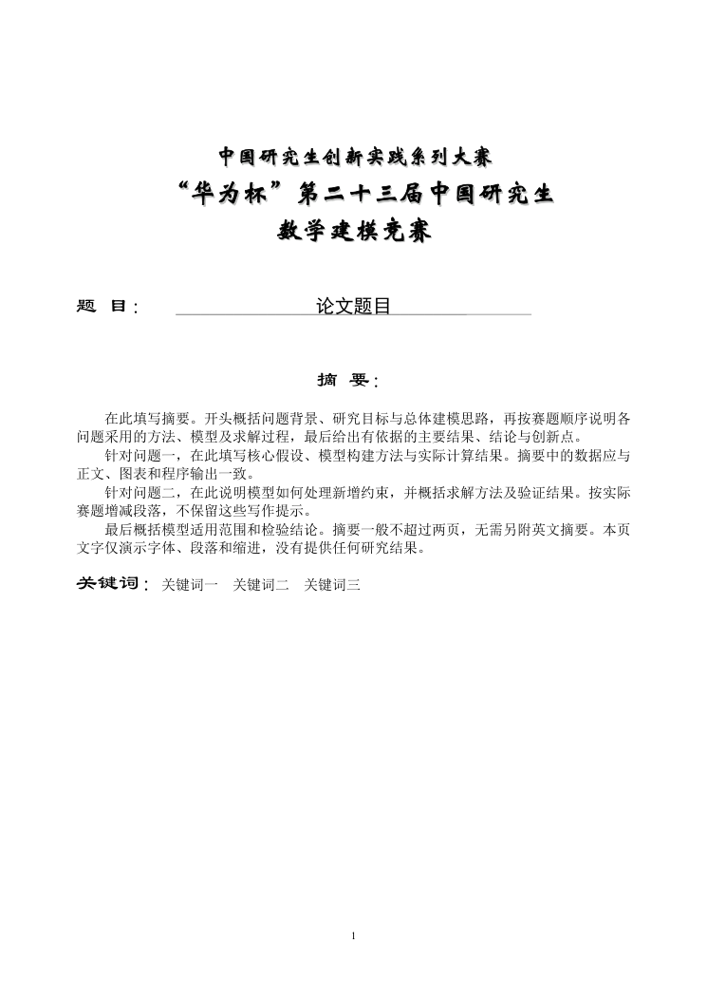

# 2026年华为杯研究生数学建模竞赛LaTeX论文模板

面向2026年“华为杯”第二十三届中国研究生数学建模竞赛的 LaTeX 论文模板。根据赛事论文格式规范与 Word 模板制作，参考2025年优秀论文的章节组织方式，提供封面、摘要、正文、公式、图表、参考文献及附录示例。

**下载 ZIP 后可直接导入 Overleaf，无需手动切换 XeLaTeX。** 项目随附所用字体和固定版面资源，避免因 Overleaf 缺少本机字体而发生字体替换；字号、段落缩进、行距和页面尺寸统一由模板控制。

本仓库为根据赛事材料整理的非官方 LaTeX 实现，不代表竞赛组委会发布或认可。

**[下载 Overleaf ZIP](https://github.com/jirouvan/GMCM2026-LaTeX/archive/refs/heads/main.zip)** · **[查看示例 PDF](example.pdf)** · **[查看格式核验记录](FORMAT-CHECK.md)**

## 效果预览

| 封面 | 摘要页 |
| --- | --- |
|  |  |

预览图来自仓库内 `example.pdf` 的实际编译结果。

## 在 Overleaf 中使用

1. 点击上方“下载 Overleaf ZIP”，或选择本仓库的 **Code → Download ZIP**。
2. 打开 [Overleaf](https://www.overleaf.com/)，选择 **New Project → Upload Project**，上传下载的 ZIP，无需提前解压。
3. 打开 `main.tex`，点击 **Recompile**。
4. 修改题目、摘要和各章节内容，再次编译即可。

主文件为 `main.tex`。如果 Overleaf 没有自动识别，在项目设置的 **Main document** 中选择它。

根目录 `latexmkrc` 会将默认编译规则自动交给 XeLaTeX，因此无需手动修改编译器选项。请完整保留 `latexmkrc`、`fonts.tex`、`fonts/` 和 `assets/`，不要只上传 `.tex` 文件。首次编译需要加载字体，耗时可能略长。

GitHub 下载包可能包含一层以仓库名命名的外层目录；解压后本地使用时，应进入包含 `main.tex` 的目录。

## 文件结构

```text
.
├── main.tex                 # 论文入口：题目、队伍信息、章节顺序
├── gmcmthesis.cls            # 字号、页边距、段落、标题、页码等
├── latexmkrc                # 自动选择实际编译引擎
├── fonts.tex                # 项目内字体配置
├── fonts/                   # 随包字体及 SHA-256 清单
├── assets/                  # 封面、赛事抬头与摘要标签的矢量资源
├── sections/                # 摘要、正文、参考文献与附录
├── figures/                 # 论文插图
├── docs/                    # README 预览图片
├── example.pdf              # 实际编译的六页示例
├── FORMAT-CHECK.md          # 格式测量、编译验证及一致性范围
└── README.md
```

仓库另外保留附件3的 PDF 参考文件，便于对照原始版式；它不参与编译。

## 填写论文

在 `main.tex` 中填写题目和封面信息：

```latex
\title{论文题目}
\schoolname{学校名称}
\baominghao{参赛队号}
\membera{队员一}
\memberb{队员二}
\memberc{队员三}
```

封面字段默认留空。论文各部分分别编辑以下文件：

| 文件 | 内容 |
| --- | --- |
| `sections/00-abstract.tex` | 摘要、关键词 |
| `sections/01-problem.tex` | 问题重述、问题分析 |
| `sections/02-assumptions.tex` | 模型假设 |
| `sections/03-notations.tex` | 符号说明 |
| `sections/04-models.tex` | 数据预处理、模型建立与求解、图表 |
| `sections/05-evaluation.tex` | 模型检验、灵敏度分析、模型评价 |
| `sections/06-conclusion.tex` | 结论 |
| `sections/07-references.tex` | 参考文献 |
| `sections/08-appendix.tex` | 附录与程序 |

正文示例是写作占位内容，表格和文献也需替换为实际研究材料。使用 `\cite{ref:actual}` 引用参考文献；图、表和公式使用 `\label`、`\ref` 交叉引用。

### 题目位置和下划线

在 `main.tex` 中调整：

```latex
\setlength{\papertitleleft}{148.1bp} % 下划线左端，增大则文字和线一起右移
\setlength{\papertitlewidth}{300bp}  % 下划线长度，文字始终在线上居中
```

当前示例采用加长下划线：宽300 bp，题目相对原区域右移约9.7毫米。

- 需要更长的线：将 `300bp` 改为 `320bp`。
- 需要整体向右移动：将 `148.1bp` 改为 `158.1bp`。
- 恢复附件3原题目区域：左端设为 `148.1bp`，宽度设为 `245.03bp`。

长题目保持三号黑体，自动向下换行，摘要标签和正文同步下移。不要通过在 `\title{...}` 中添加空格来移动文字。

### 封面与目录

默认保留封面。若实际提交要求匿名正文，在 `main.tex` 中注释 `\makecover` 即可。

根据格式规范，摘要之后下一页进入正文，因此默认不生成目录。如另有目录要求，可在 `\startbody` 前加入 `\maketoc`。最终提交内容应按当届正式要求检查。

## 字体与版式

| 部分 | 设置 |
| --- | --- |
| 封面与赛事抬头 | 保留附件3原始矢量内容、字体和位置 |
| “题目”“摘要”等固定标签 | 附件3的18 bp隶书 |
| 论文题目 | 三号黑体，16 bp |
| 一级标题 | 四号黑体，14 bp，居中 |
| 正文 | 小四宋体，12 bp |
| 二、三级标题 | 小四宋体，二级加粗 |
| 段落 | 首行缩进两字，即24 bp；段前段后0 |
| 正文行距 | 按 Word 单倍行距与文档网格校准为15.6 bp |
| 英文及数字 | Times New Roman；封面填写区按原格式使用 Calibri Bold |
| 图表 | 表题在上、图题在下，正文大小宋体 |
| 页码 | 摘要从1开始，底部居中，无页眉 |
| 参考文献 | 方括号编号，按引用顺序排列 |

`bp` 是 Word/PDF 使用的点单位，1 bp = 1/72英寸，与 LaTeX 的 `pt` 略有不同。字体通过项目内文件加载，不依赖 Overleaf 系统中的近似字体。

### “格式保持一致”的范围

完整导入项目后，相同源码使用相同字体、宏包和编译环境，可保持模板指定的字体和版式设置，不会因缺少 Windows 字体而自动替换为 Fandol 等字体。更改正文、图表数量或标题长度后，断行和分页会正常随内容变化。

本项目不承诺与 Word 对任意内容逐字断行、逐页分布或逐像素相同。Word 与 TeX 的排版算法不同；实测固定区存在最多2/255的颜色通道差，44行正文末行存在0.6 bp的坐标差。当前示例的加长题目下划线也是相对原 Word 模板的主动调整。

## 本地编译与验证

在包含 `main.tex` 的目录运行：

```sh
latexmk -pdf -interaction=nonstopmode -halt-on-error main.tex
```

实际验证环境为 **TeX Live 2026 / XeLaTeX / latexmk**，通过项目内 `latexmkrc` 自动调用引擎。核验结果：

- 六页示例编译成功，最终日志无 LaTeX Warning、字体替换、缺字、未定义引用或盒子溢出。
- PDF 使用的全部字体已嵌入。
- 长题目、跨两页摘要、44行正文、连续页码、公式、三线表和附录编号测试通过。
- 题目下划线调整后重新编译并检查，其余页面保持原样。
- 发布前将 ZIP 解压到独立目录重新编译，六页结果与 `example.pdf` 逐页像素一致（同一环境与渲染器）。

测试采用本地 Overleaf 等效默认编译命令，未将“等效验证”冒充为在线账户实测。详细测量见 [FORMAT-CHECK.md](FORMAT-CHECK.md)。不同 TeX Live 或宏包版本可能影响排版，复现时建议使用相同版本。

## 常见问题

**提示需要 XeTeX，或在 `RequireXeTeX` 处停止？**

确认 `latexmkrc` 与 `main.tex` 位于同一级，文件名没有被改成 `latexmkrc.txt`。完整重新导入 ZIP；不要只复制主文件。

**字体与示例不一致，或提示找不到字体？**

确认 `fonts/` 中的字体完整上传，文件名大小写没有改变，并保留 `fonts.tex`。字体文件的校验值见 `fonts/manifest.json`。

**修改后希望恢复初始效果？**

重新下载一份 ZIP 与当前项目对照，保留自己的正文内容，再恢复对应模板配置。`example.pdf` 是预览文件，不是论文源文件。

## 来源与第三方材料

版式依据为附件2《“华为杯”第二十三届中国研究生数学建模竞赛论文格式规范》和附件3论文模板；优秀论文仅作为章节结构参考。本模板不包含优秀论文的研究成果或正文复用。

赛事标识、参考模板、字体等第三方材料的权利归各自权利人。字体来自本机现有字库，来源和哈希记录于 `fonts/manifest.json`；仓库公开不等于对这些第三方材料授予额外许可。
